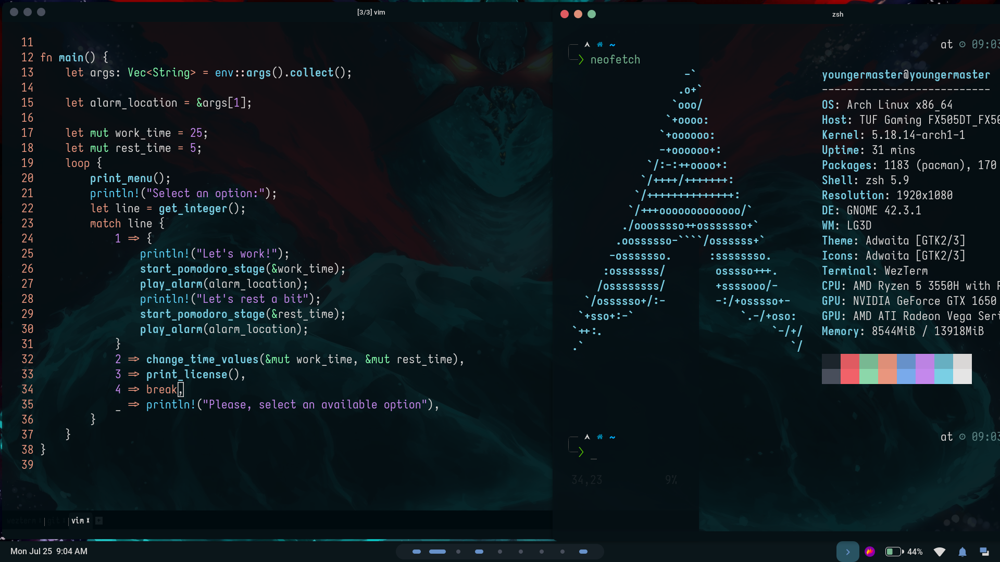
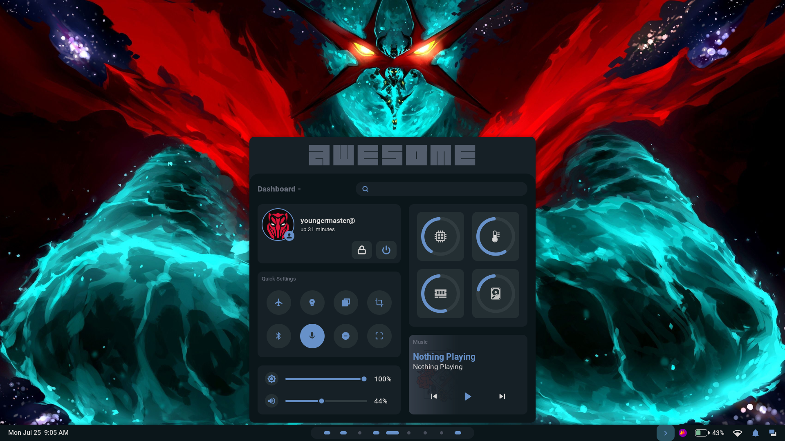
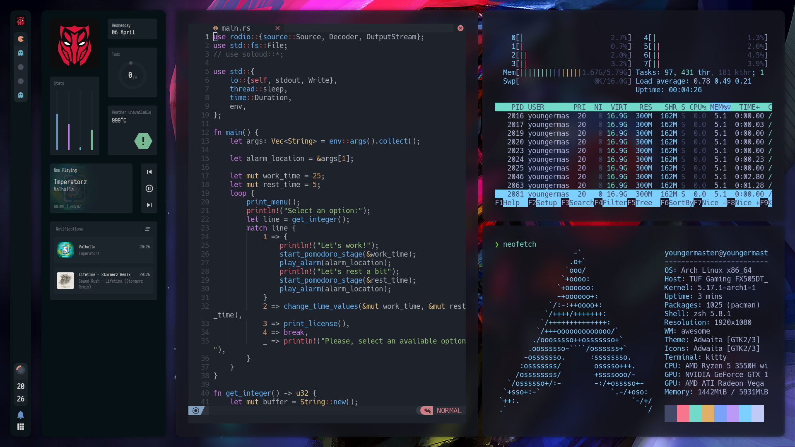
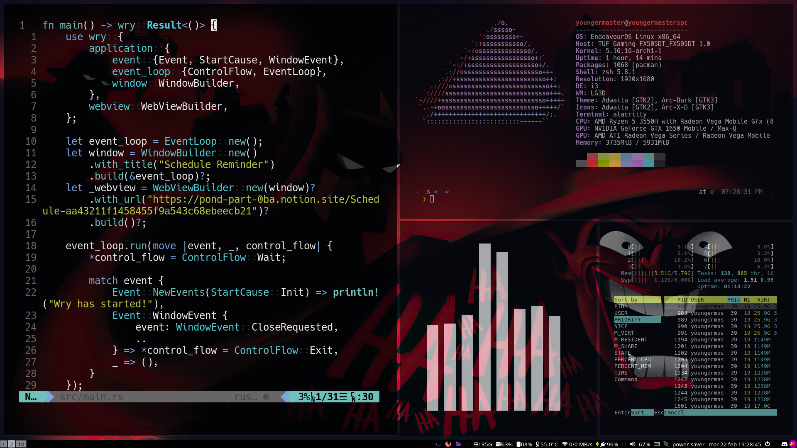

# Arch dotfiles

Those are some of my dotfiles for my Arch Linux Machine.

## How it looks?

### Minimal Super Tengen 

### HyperCandy (Under development)

This configs are in the folder [`Archcraft`](https://github.com/Youngermaster/Arch-dotfiles/tree/main/Archcraft).

### Paracelsus Gnome (Under development)

This configs are in the folder [`Archcraft`](https://github.com/Youngermaster/Arch-dotfiles/tree/main/Archcraft).

 Gnome configs 

<blockquote>

- GTK Themes: Based on [AestheticStuff by Rxyhn](https://github.com/rxyhn/AestheticStuff) and [Dots by iamverysimp1e](https://github.com/iamverysimp1e/dots).

- GTK Icons:[Papirus icons ](https://www.gnome-look.org/p/1166289)

- [Gnome Shell Extensions](https://extensions.gnome.org/):

  - [User Themes](https://extensions.gnome.org/extension/19/user-themes/): Load shell themes from user directories.
  - [X11 Gestures](https://extensions.gnome.org/extension/4033/x11-gestures/): Enable GNOME Shell multi-touch gestures on X11.
  - [AppIndicator](https://extensions.gnome.org/extension/4033/x11-gestures/): Adds AppIndicator, KStatusNotifierItem and legacy Tray icons support to the Shell.
  - [Aylur's Widget](https://extensions.gnome.org/extension/5338/aylurs-widgets/): Beautiful Plugins with customizable bar.
  - [Blur My Shell](https://extensions.gnome.org/extension/3193/blur-my-shell/): Blur the gnome shell.
  - [Color Picker](https://extensions.gnome.org/extension/3396/color-picker/): The simple color picker for gnome shell.
  - [Extension List](https://extensions.gnome.org/extension/3088/extension-list/): A Simple Gnome shell extension manager in the top panel.
  - [Just Perfection](https://extensions.gnome.org/extension/3843/just-perfection/): SImple tweak tools to customize the gnome shell and disable some UI Features.
  - [Unite](https://extensions.gnome.org/extension/1287/unite/): Remove the title bars of the windows for the minimalist in windows.
  - [Vitals](https://extensions.gnome.org/extension/1460/vitals/): A simple system monitor on the top bar.
  - [gtk title bar](https://extensions.gnome.org/extension/1732/gtk-title-bar/): Remove title bar for non-gtk apps with minimal inference.
  - [Rounded Window Corners](https://extensions.gnome.org/extension/5237/rounded-window-corners/): Rounded corners for all windows.
</blockquote>

### Aesthetic AwesomeWM

### Batman Beyond Theme

### Endeavour OS Batman Theme

## Notes:

I use these repositories as a base to start:

- https://github.com/rxyhn/dotfiles
- https://github.com/Axarva/dotfiles-2.0
- https://github.com/janleigh/dotfiles

And also I acknowledge [S4vitar](https://github.com/S4vitar)'s work for some tweaks with the **Aesthetic AwesomeWM**, you can learn more about it with this [video](https://www.youtube.com/watch?v=fshLf6u8B-w&ab_channel=s4vitar).
